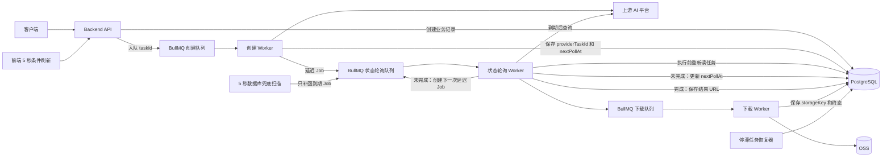
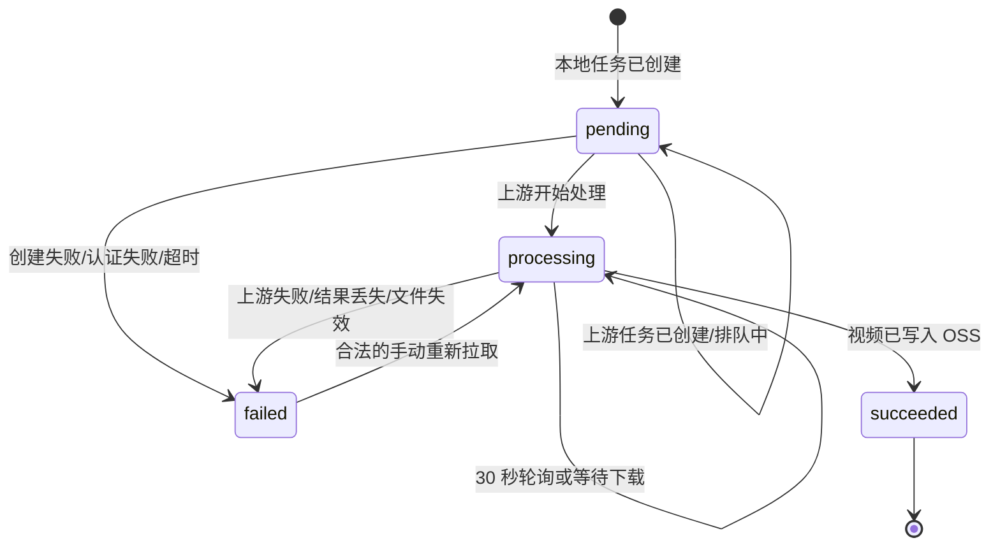

# Narrix 异步轮询机制与新项目复用方案

> 核对日期：2026-08-28  
> 线上服务器：`8.156.73.136`  
> 视频服务版本：`20260827-video-poll-jobs`  
> 适用技术栈：Node.js + TypeScript + PostgreSQL + Redis + BullMQ

## 1. 结论

Narrix 的视频异步轮询不是一个固定定时器直接批量请求上游，而是以下组合：

1. PostgreSQL 的 `next_poll_at` 保存任务下一次允许轮询的时间，是调度事实来源。
2. BullMQ 为每个任务创建延迟 Job，是正常轮询的主驱动。
3. `worker-video` 每 5 秒扫描一次数据库，只把遗漏的到期任务补回 BullMQ，不直接查询上游。
4. 延迟 Job 执行时再次读取数据库并校验 `next_poll_at`，过早触发只会重新排队。
5. 每次上游仍未完成时，将 `next_poll_at` 更新为当前时间后 30 秒，再创建下一次延迟 Job。
6. 上游完成后停止状态轮询，进入独立 `download-video` 队列下载结果并上传 OSS。
7. Redis/BullMQ 丢失 Job 时，数据库扫描可以恢复；数据库仍是最终业务状态来源。

这个模型可以概括为：

> 数据库保存意图和状态，BullMQ 负责准时执行，定时扫描负责修复遗漏。

## 2. 当前线上部署事实

线上各容器实际镜像并不完全相同：

| 服务 | 当前镜像/版本 |
| --- | --- |
| `backend` | `narrix-backend:20260827-video-poll-jobs` |
| `worker-video` | `narrix-backend:20260827-video-poll-jobs` |
| `worker-asset-sync` | `narrix-backend:20260826-video-download-queue` |
| `frontend` | `narrix-frontend:20260825-video-ref-limits` |
| PostgreSQL | `postgres:16-alpine` |
| Redis | `redis:7-alpine` |

本地 `video.worker.ts` 与线上 `20260827-video-poll-jobs` 文件哈希一致。素材 Worker 的当前本地实现也与线上实际运行文件一致。

## 3. 总体架构



## 4. 视频任务完整生命周期

### 4.1 创建任务

API 的职责很轻：

1. 校验请求和权限。
2. 在数据库创建一条 `pending` 记录。
3. 保存请求快照和幂等键。
4. 向 `create-and-sync-video` 队列发送 `{ taskId }`。
5. 立即向客户端返回本地任务 ID，不等待上游生成完成。

创建队列参数：

| 配置 | 当前值 |
| --- | ---: |
| 队列名 | `create-and-sync-video` |
| Worker 并发 | 2 |
| BullMQ 尝试次数 | 3 |
| 退避 | 指数退避，基数 3 秒 |
| Job ID | `video-create-{taskId}` |

固定 Job ID 可以防止同一个本地任务被重复创建为多个上游任务。创建 Worker 还会先检查数据库中是否已经存在 `ark_task_id`；存在则直接跳过，因此消费端也是幂等的。

### 4.2 创建上游任务并安排首次轮询

创建 Worker 调用上游平台后，将以下信息落库：

- 上游任务 ID：`ark_task_id`
- 本地状态：`pending`
- 下一次轮询时间：`next_poll_at`
- 上游状态变化基准时间：`last_ark_status_changed_at`

当前首次轮询不是统一 30 秒：

| 场景 | 首次轮询延迟 |
| --- | ---: |
| ToAPIs / `signed_url` 素材模式 | 10 秒 |
| 方舟 / `provider_asset` 素材模式 | 5 分钟 |
| 首次轮询后的常规间隔 | 30 秒 |

数据库更新成功后，Worker 用 `next_poll_at` 创建 BullMQ 延迟 Job。入队失败被允许暂时忽略，因为数据库兜底扫描稍后会补入。

### 4.3 每任务延迟轮询

状态队列名为 `sync-video-status`，正常运行时每个 Job 只处理一个 `taskId`。

Job ID 格式：

```text
video-sync-{taskId}-{runAtEpochMs}
```

将计划执行时间放入 Job ID 有两个目的：

- 同一个任务、同一个执行时间只保留一个 Job。
- 同一个任务可以在不同时间拥有连续的多次轮询 Job。

状态 Worker 的执行顺序：

1. 按 `taskId` 重新读取数据库。
2. 任务不存在、已经终态、已经有 OSS 成品时直接返回。
3. 已经拿到上游结果 URL 时，不再查询状态，转入下载队列。
4. `next_poll_at > now` 时只按正确时间重新创建延迟 Job，不访问上游。
5. 到期后才调用上游状态查询接口。
6. 将上游状态映射为本地状态并持久化。
7. 未完成时写入新的 `next_poll_at = now + 30s`，再创建下一次延迟 Job。

当前状态队列参数：

| 配置 | 当前值 |
| --- | ---: |
| 队列名 | `sync-video-status` |
| Worker 并发 | 5 |
| BullMQ 尝试次数 | 2 |
| 退避 | 指数退避，基数 5 秒 |
| 常规业务轮询间隔 | 30 秒 |

这里存在两类重试，不能混淆：

- BullMQ 重试用于 Worker 异常、Redis/运行时错误等 Job 执行失败。
- 业务轮询用于上游任务仍在处理，或一次状态查询出现可恢复错误；它通过更新 `next_poll_at` 并创建新 Job 实现。

### 4.4 状态映射和终止条件

| 上游状态 | 本地状态 | 后续动作 |
| --- | --- | --- |
| `queued`、`pending` | `pending` | 30 秒后再轮询 |
| `running`、`processing`、`in_progress` | `processing` | 30 秒后再轮询 |
| `succeeded`、`completed` | 暂时保持 `processing` | 保存结果 URL，进入下载队列 |
| `failed` 等失败状态 | `failed` | 清空 `next_poll_at`，停止轮询 |

只有视频成功写入 OSS 并保存 `video_oss_key` 后，本地任务才标记为 `succeeded`。这避免“上游生成完成，但平台还没有可稳定交付的成品”被误报为成功。

### 4.5 上游查询错误策略

| 情况 | 当前处理 |
| --- | --- |
| 上游认证失败 | 当前任务标记 `failed`，`next_poll_at = null`，停止轮询 |
| 网络错误或临时查询失败 | 保持非终态，30 秒后创建下一次轮询 |
| 查询响应不包含当前任务 | 记录日志，30 秒后继续；超过停滞阈值后失败 |
| 上游状态持续不变化超过 24 小时 | 标记 `failed`，停止轮询 |
| 上游成功但没有结果 URL | 标记 `failed`，停止轮询 |

每个轮询 Job 只处理一个任务，因此某个用户或平台凭据的认证错误不会阻塞同批其他任务。

### 4.6 数据库兜底扫描

`worker-video` 启动时先执行一次扫描，之后每 5 秒执行一次：

```sql
select *
from video_tasks
where status in ('pending', 'processing')
  and ark_task_id is not null
  and ark_video_url is null
  and video_oss_key is null
  and next_poll_at is not null
  and next_poll_at <= now()
order by next_poll_at, updated_at
limit 20;
```

扫描器只做一件事：把这些到期任务按数据库中的执行时间补入 `sync-video-status`。

它不会直接请求上游，所以“5 秒扫描”不等于“每个任务 5 秒轮询”。单任务仍受 `next_poll_at` 和 30 秒业务间隔约束。

当前扫描参数：

| 配置 | 当前值 |
| --- | ---: |
| 扫描间隔 | 5 秒 |
| 每批上限 | 20 条 |
| 单次扫描看门狗 | 30 秒 |
| 防重入 | 同一进程中上一轮未结束则跳过本轮 |

这套兜底可以处理：

- 数据库已更新，但 BullMQ 入队失败。
- Redis 数据丢失或清空。
- Worker 在更新数据库后、入队前崩溃。
- Worker 重启时有已经到期的历史任务。

### 4.7 停滞任务恢复

除 5 秒到期扫描外，视频 Worker 每 60 秒运行一次恢复器：

- 查询 `pending` / `processing` 且 10 分钟未更新的任务。
- 每次最多处理 20 条。
- 没有上游任务 ID：重新加入创建队列。
- 有上游任务 ID、没有成品、但 `next_poll_at` 为空：恢复轮询时间并重新入队。
- 已有上游结果 URL：转入下载队列。

5 秒扫描修复“应该执行但 Job 丢了”，60 秒恢复器修复“任务状态本身缺少下一步计划”。

### 4.8 独立下载队列

上游返回完成状态后，状态 Worker 不承担大文件下载。它只保存 `ark_video_url`，然后发送 `download-video` Job。

| 配置 | 当前值 |
| --- | ---: |
| 队列名 | `download-video` |
| Worker 并发 | 3 |
| Job ID | `video-download-{taskId}` |
| BullMQ 尝试次数 | 1 |
| 数据库下载补偿扫描 | 30 秒 |
| 下载连接超时 | 30 秒 |
| 流空闲超时 | 2 分钟 |
| 下载整体超时 | 15 分钟 |
| 下载租约失效时间 | 20 分钟 |

下载处理采用数据库租约：

1. 原子更新 `download_claimed_at` 和随机 `download_claim_token`。
2. 只有拿到租约的 Worker 可以下载。
3. 完成状态更新必须携带同一个 token。
4. 超过 20 分钟的租约可以被其他 Worker 接管。

下载成功后流式上传 OSS，保存 `video_oss_key` 并将任务标记为 `succeeded`。下载或 OSS 临时失败时释放租约，将 `next_poll_at` 设为 30 秒后，由下载扫描器再次入队。HTTP 403/404 被视为不可恢复错误，直接进入 `failed`。

将下载与状态查询拆开，可以防止慢下载占满状态轮询 Worker，避免其他已完成任务长时间得不到处理。

### 4.9 手动拉取

用户点击“重新拉取”时，API 不直接同步请求上游，而是：

1. 将任务恢复为 `processing`。
2. 设置 `next_poll_at = now + 1s`。
3. 创建对应的延迟 Job。
4. 入队失败仍由 5 秒扫描兜底。

手动操作和自动轮询使用同一条处理路径，避免产生两套状态逻辑。

## 5. 视频任务状态机



终态必须满足：

- `succeeded`：本地可交付对象已经存在于 OSS。
- `failed`：保存明确错误原因，并将 `next_poll_at` 清空。

## 6. 素材同步轮询

素材同步与视频状态轮询不是同一种实现。

### 6.1 当前机制

素材使用两个 BullMQ 队列：

| 队列 | Worker 并发 | 尝试次数 | 退避 |
| --- | ---: | ---: | --- |
| `sync-asset-status` | 3 | 3 | 指数退避，基数 3 秒 |
| `delete-asset` | 2 | 5 | 指数退避，基数 5 秒 |

素材同步 Job 在一次 Job 执行期间循环查询上游：

- 查询间隔：3 秒。
- 最大查询次数：40 次。
- 最长正常等待时间：约 120 秒。
- 上游 `Active`：标记 `active`。
- 上游 `Failed`：标记 `failed`。
- 达到次数上限：标记 `failed`，错误为 `timeout`。
- 网络、超时、5xx、限流等瞬时错误：回到 `pending` 并抛出错误，由 BullMQ 重试。

素材 Worker 每 2 分钟扫描一次 `pending`、`processing`、`deleting`，只处理 3 分钟以上未更新的素材。当前实现会直接调用处理器恢复，而不是先重新放回 BullMQ。

### 6.2 新项目建议

如果单任务通常在 1 至 2 分钟内结束，Job 内短轮询可以接受；如果可能持续几分钟以上，建议统一采用视频任务模式：每次 Job 只查一次，写入 `next_poll_at` 后重新创建延迟 Job。

新项目的恢复器也建议只负责重新入队，不直接调用业务处理器。这样并发限制、失败重试和监控全部经过 BullMQ，行为更一致。

## 7. 前端状态刷新

前端轮询只刷新 Narrix API 中的本地状态，不直接访问上游平台。

当前实现：

- 视频页面存在 `pending` 或 `processing` 任务时，每 5 秒刷新任务列表。
- 素材页面存在 `pending`、`processing` 或 `deleting` 素材时，每 5 秒刷新素材和素材组。
- 页面没有活动任务时停止轮询。
- React 组件卸载或条件变化时清理 `setInterval`。

新项目建议额外增加：

- 页面不可见时暂停或降低频率。
- 请求未结束时不启动下一次请求，避免重叠刷新。
- 失败后指数退避，并加入少量随机抖动。
- 多标签页场景可通过 `BroadcastChannel` 共享刷新结果。
- 活跃任务很多时，优先考虑 SSE；WebSocket 仅在确实需要双向实时通信时使用。

## 8. 数据库字段

### 8.1 Narrix 当前关键字段

| 字段 | 用途 |
| --- | --- |
| `status` | 本地业务状态 |
| `ark_task_id` | 上游任务 ID |
| `ark_video_url` | 上游完成后的临时结果 URL |
| `video_oss_key` | 本地 OSS 成品键 |
| `next_poll_at` | 下一次允许轮询或下载重试时间 |
| `last_polled_at` | 最近一次实际查询上游的时间 |
| `last_ark_status` | 最近一次上游状态 |
| `last_ark_status_changed_at` | 上游状态最近变化时间，用于停滞判定 |
| `download_claimed_at` | 下载租约开始时间 |
| `download_claim_token` | 下载租约令牌 |
| `error_message` | 最后错误原因 |
| `created_at` / `updated_at` | 创建、更新时间 |

### 8.2 新项目推荐的通用表

```sql
create table async_tasks (
  id bigserial primary key,
  task_type varchar(64) not null,
  provider varchar(64) not null,
  provider_task_id varchar(255),
  status varchar(32) not null,
  request_payload jsonb not null,
  provider_result_url text,
  storage_key text,
  next_poll_at timestamptz,
  last_polled_at timestamptz,
  last_provider_status varchar(64),
  last_status_changed_at timestamptz,
  error_message text,
  claimed_at timestamptz,
  claim_token varchar(64),
  created_at timestamptz not null default now(),
  updated_at timestamptz not null default now()
);

create index idx_async_tasks_due
  on async_tasks (next_poll_at, updated_at)
  where status in ('pending', 'processing')
    and next_poll_at is not null;

create index idx_async_tasks_stale
  on async_tasks (updated_at)
  where status in ('pending', 'processing');
```

如果任务种类差异很大，可以保留各自业务表，但应统一抽象调度字段和 Dispatcher 接口。

## 9. BullMQ 核心实现骨架

以下代码保留 Narrix 的关键设计，但使用通用命名。

### 9.1 安排延迟轮询

```ts
import { Queue, Worker, type Job } from 'bullmq'

type PollJob = { taskId: number }

const POLL_INTERVAL_MS = 30_000
const SCAN_INTERVAL_MS = 5_000
const POLL_QUEUE_NAME = 'task-status-poll'

const pollQueue = new Queue<PollJob>(POLL_QUEUE_NAME, { connection })

const pollJobId = (taskId: number, runAt: Date) =>
  `task-poll-${taskId}-${runAt.getTime()}`

async function schedulePoll(taskId: number, runAt: Date): Promise<void> {
  await pollQueue.add(
    POLL_QUEUE_NAME,
    { taskId },
    {
      jobId: pollJobId(taskId, runAt),
      delay: Math.max(0, runAt.getTime() - Date.now()),
      attempts: 2,
      backoff: { type: 'exponential', delay: 5_000 },
      removeOnComplete: true,
      removeOnFail: 100,
    }
  )
}
```

生产代码应像 Narrix 一样先检查同 ID Job 的状态；对 `waiting`、`active`、`delayed` 等状态直接复用，对已经结束且可删除的旧 Job 先清理再创建。

### 9.2 单任务处理器

```ts
const pollWorker = new Worker<PollJob>(
  POLL_QUEUE_NAME,
  async (job: Job<PollJob>) => {
    const task = await repository.findById(job.data.taskId)
    if (!task || isTerminal(task.status)) return

    const now = new Date()

    // 数据库时间是权威值，旧 Job 或过早 Job 不得访问上游。
    if (task.nextPollAt && task.nextPollAt > now) {
      await schedulePoll(task.id, task.nextPollAt)
      return
    }

    let result: ProviderTaskResult
    try {
      result = await provider.getTask(task.providerTaskId)
    } catch (error) {
      if (isAuthenticationError(error)) {
        await repository.markFailed(task.id, errorMessage(error))
        return
      }

      const nextPollAt = new Date(now.getTime() + POLL_INTERVAL_MS)
      await repository.scheduleRetry(task.id, {
        lastPolledAt: now,
        nextPollAt,
        errorMessage: errorMessage(error),
      })
      await schedulePoll(task.id, nextPollAt).catch(() => undefined)
      return
    }

    if (isPending(result.status)) {
      const nextPollAt = new Date(now.getTime() + POLL_INTERVAL_MS)
      await repository.saveProgress(task.id, result, now, nextPollAt)
      await schedulePoll(task.id, nextPollAt).catch(() => undefined)
      return
    }

    if (isSucceeded(result.status)) {
      await repository.prepareResult(task.id, result, now)
      await downloadQueue.add('download-result', { taskId: task.id })
      return
    }

    await repository.markFailed(task.id, result.errorMessage ?? '上游任务失败')
  },
  { connection, concurrency: 5 }
)
```

关键顺序是“先写数据库，再尝试入队”。如果进程恰好在两者之间崩溃，扫描器可以根据数据库恢复；反过来则可能出现 Job 先执行、数据库计划尚未保存的问题。

### 9.3 到期任务扫描器

```ts
let scanRunning = false

async function enqueueDueTasks(): Promise<void> {
  if (scanRunning) return
  scanRunning = true

  try {
    const dueTasks = await repository.listDueTasks({
      now: new Date(),
      limit: 20,
    })

    await Promise.all(
      dueTasks.map((task) =>
        schedulePoll(task.id, task.nextPollAt ?? new Date())
      )
    )
  } finally {
    scanRunning = false
  }
}

void enqueueDueTasks()
const scanTimer = setInterval(() => void enqueueDueTasks(), SCAN_INTERVAL_MS)
scanTimer.unref?.()
```

扫描器不得包含 `provider.getTask()`。否则扫描频率会意外变成上游请求频率，也会重新引入批次阻塞。

## 10. 一致性和幂等要求

BullMQ 提供的是至少一次执行语义，不应假定 exactly-once。新项目至少要满足：

1. API 创建请求有幂等键，重复请求不会创建两条业务任务。
2. 创建 Job 使用固定 Job ID，Worker 也检查 `provider_task_id`。
3. 状态轮询 Job 使用 `taskId + runAt` 作为 Job ID。
4. Worker 每次执行都重新读取任务，终态直接跳过。
5. 状态更新带条件，例如只允许从非终态更新。
6. 下载等有副作用的步骤使用数据库租约或原子 claim。
7. 终态清空 `next_poll_at`，避免被扫描器复活。
8. 日志包含本地任务 ID、上游任务 ID、Job ID、计划时间和调度延迟。

当吞吐量进一步增大时，可引入事务 Outbox；当前规模下，“数据库事实 + 定期补偿扫描 + 幂等 Job ID”已经能覆盖最常见的进程崩溃和 Redis 丢任务问题。

## 11. 推荐配置项

新项目不要将所有参数散落为代码常量，建议集中配置：

| 配置项 | Narrix 当前值 | 说明 |
| --- | ---: | --- |
| `TASK_POLL_INTERVAL_MS` | 30000 | 单任务常规轮询间隔 |
| `TASK_SCAN_INTERVAL_MS` | 5000 | 数据库补偿扫描间隔 |
| `TASK_SCAN_BATCH_SIZE` | 20 | 每轮补偿数量 |
| `TASK_POLL_CONCURRENCY` | 5 | 状态查询并发 |
| `TASK_RECONCILE_INTERVAL_MS` | 60000 | 停滞恢复器间隔 |
| `TASK_RECONCILE_STALE_MS` | 600000 | 任务停滞判定 |
| `TASK_MAX_UNCHANGED_MS` | 86400000 | 上游状态最长不变化时间 |
| `DOWNLOAD_CONCURRENCY` | 3 | 下载并发 |
| `DOWNLOAD_RETRY_DELAY_MS` | 30000 | 下载业务重试间隔 |
| `DOWNLOAD_CLAIM_TIMEOUT_MS` | 1200000 | 下载租约失效时间 |
| `UI_REFRESH_INTERVAL_MS` | 5000 | 活跃页面刷新间隔 |

还应按上游平台分别配置首次轮询延迟、限流并发和最大停滞时长。

## 12. 新项目落地顺序

1. 建立任务状态机和数据库字段，先确定哪些状态是终态。
2. 实现 Repository，特别是到期查询、条件更新和原子 claim。
3. 建立创建、轮询、下载三个独立队列。
4. 实现单任务轮询 Worker，确保执行前检查数据库计划时间。
5. 在每次非终态结果后同时保存下一次时间并创建延迟 Job。
6. 实现 5 秒数据库兜底扫描，扫描器只补 Job。
7. 实现停滞恢复器，处理缺失上游 ID、缺失计划时间和过期租约。
8. 前端仅在存在活动任务时刷新本地 API。
9. 增加结构化日志、队列指标和任务耗时指标。
10. 完成故障注入测试后再提高 Worker 并发。

## 13. 必测场景

### 13.1 单元测试

- 同一任务和相同 `runAt` 只能创建一个 Job。
- Job 提前触发时不调用上游，只重新安排。
- 上游 `processing` 时准确安排 30 秒后的 Job。
- 临时网络错误仍安排下一次轮询。
- 认证错误只终止当前任务。
- 已终态任务或已有 OSS 成品时不访问上游。
- 扫描器每轮最多处理配置的批量数，且不调用上游。
- 上游完成后只进入下载队列，状态 Worker 不下载文件。
- 下载租约只能被一个 Worker 获取。
- 过期下载租约可以恢复。
- 403/404 进入失败终态，临时错误进入延迟重试。

### 13.2 集成和故障测试

- 更新 `next_poll_at` 后、BullMQ 入队前强制结束进程，任务应被扫描器恢复。
- 清空 Redis 后保留 PostgreSQL，所有到期任务应重新出现。
- 重启 Worker，已有延迟任务不能被重复请求上游。
- 同时启动两个 Worker 实例，任务不能被重复创建或重复下载。
- 上游接口持续超时，任务不能形成紧密重试循环。
- 下载耗时很长时，状态轮询吞吐不受影响。
- 前端切换到后台标签页后按预期暂停或降频。

## 14. 监控指标

至少采集以下指标：

- 各队列 `waiting`、`delayed`、`active`、`failed` 数量。
- `now - next_poll_at` 的调度延迟分布。
- 上游查询成功率、超时率、认证错误率和 429 比例。
- 每个平台的任务创建到上游完成耗时。
- 上游完成到 OSS 成品就绪耗时。
- 数据库兜底扫描每轮补入数量。
- 停滞恢复器每轮修复数量。
- 下载租约过期和被接管次数。
- 前端列表 API 的轮询请求量和失败率。

告警应优先关注“到期未处理时间”，而不只是队列长度。队列很短但任务已经延迟数分钟，通常比队列很多但仍准时更严重。

## 15. 可改进点

Narrix 当前方案已经具备可靠恢复能力，新项目可以在以下位置进一步收紧：

1. 素材恢复器改成只重新入队，避免直接调用处理器绕过队列并发控制。
2. 前端用递归 `setTimeout` 或查询库替代裸 `setInterval`，防止慢请求重叠。
3. 为到期查询使用部分索引，并在高并发扫描时考虑 `FOR UPDATE SKIP LOCKED` 或调度租约。
4. 多实例部署时，可为数据库扫描器增加 leader lock，减少重复查询；Job ID 防重仍需保留。
5. 给业务重试增加指数退避和随机抖动，避免上游故障恢复瞬间形成请求尖峰。
6. 按平台限流，不要只依靠全局 Worker 并发。
7. 任务量达到高数量级后引入 Outbox，进一步缩小数据库更新与入队之间的一致性窗口。
8. 删除未被运行时使用的旧批量轮询处理器，避免维护者误认为系统仍按批次直接轮询。

## 16. 当前实现入口

- 视频 Worker：`backend/src/workers/video.worker.ts`
- 视频任务 Repository 与服务：`backend/src/services/video.service.ts`
- 视频轮询字段迁移：`backend/src/db/migrations/20260602093000_add_video_task_polling_fields.ts`
- 视频下载租约迁移：`backend/src/db/migrations/20260826193000_add_video_download_claim.ts`
- 素材 Worker：`backend/src/workers/asset-sync.worker.ts`
- 前端轮询 Hook：`frontend/src/hooks/usePolling.ts`
- 视频页面刷新：`frontend/src/pages/Videos/index.tsx`
- 素材页面刷新：`frontend/src/pages/Assets/index.tsx`
- 视频 Worker 测试：`tests/backend/video-workers.test.ts`
- 素材 Worker 测试：`tests/backend/asset-sync.worker.test.ts`

## 17. 迁移时最重要的边界

可以直接复用的是架构模式，不应机械复制 Narrix 的具体时间参数。

新项目需要根据以下因素重新计算轮询间隔和并发：

- 上游平台的 QPS、并发限制和计费方式。
- 平均任务完成时间和 P95/P99 完成时间。
- 用户可接受的状态延迟。
- 单次查询成本。
- Worker 实例数量。
- 下载文件大小、带宽和 OSS 写入能力。

无论参数如何变化，都应保留这三个不变量：

1. Job 执行前以数据库状态和计划时间为准。
2. 每次处理必须幂等，允许至少一次执行。
3. 队列丢失后能够仅凭数据库恢复任务。
